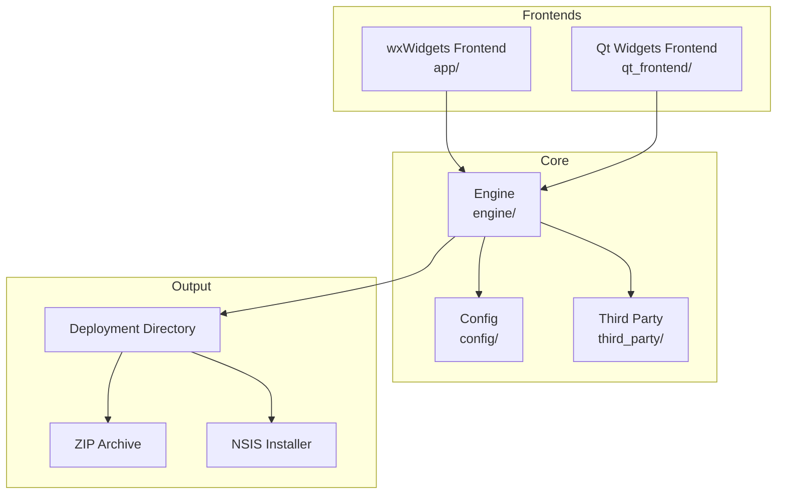
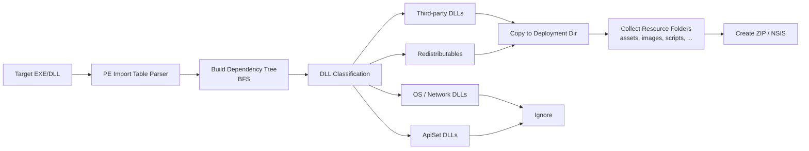
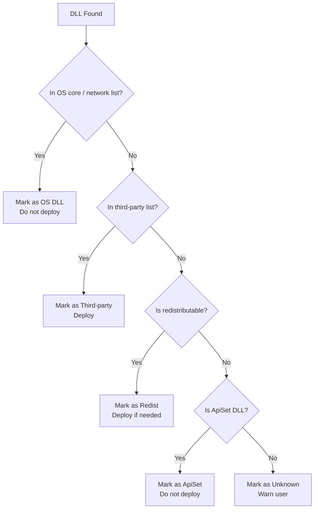
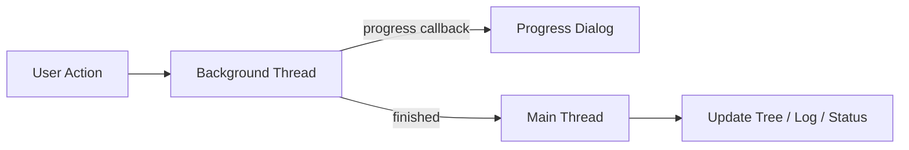
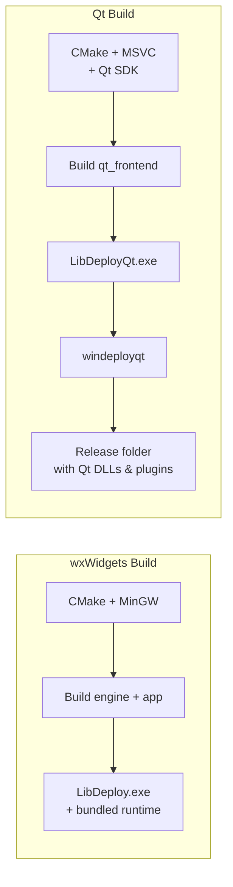

<p align="center">
  
</p>

<h1 align="center">LibDeploy</h1>

<p align="center">
  <strong>Windows dependency analysis and packaging tool for desktop applications.</strong>
</p>

<p align="center">
  <a href="#highlights">Highlights</a> •
  <a href="#frontends">Frontends</a> •
  <a href="#build">Build</a> •
  <a href="#repository-layout">Layout</a> •
  <a href="#dependencies">Dependencies</a> •
  <a href="#open-source-projects-used">Open Source</a> •
  <a href="#diagrams">Diagrams</a>
</p>

<p align="center">
  <a href="README.zh-CN.md">简体中文</a> • <strong>English</strong>
</p>

<p align="center">
  
  
  
  
  
  
  
  
</p>

> **LibDeploy** scans an EXE/DLL, classifies its runtime dependencies, collects related resource folders, and produces a deployable directory, ZIP package, or NSIS installer.

---

## Screenshots

|          wxWidgets Frontend           |               Qt Frontend               |
| :-----------------------------------: | :-------------------------------------: |
|  |  |

---

## Highlights

- **Dependency analysis** — Parses PE import tables and builds a full dependency tree via BFS.
- **DLL classification** — Separates OS core DLLs, network DLLs, third-party DLLs, redistributables, and ApiSet DLLs.
- **Resource packaging** — Keeps folders such as `assets/`, `images/`, `scripts/`, `docs/`, `plugins/`, `packages/`, `webview2_runtime/`.
- **Smart directory skip** — Ignores build-output directories (`bin/`, `Release/`, `Debug/`, `x64/`, `_deploy/`, etc.) to avoid polluting the output.
- **Deployment** — Copies required files into a clean deployment directory.
- **ZIP packaging** — Creates ZIP archives with real-time per-file compression progress (0 → 100 %).
- **NSIS installer** — Generates NSIS installers with Start Menu and desktop shortcuts.
- **Async operations** — All long-running tasks (analyze, deploy, ZIP, installer) run in background threads with a live progress dialog.
- **Recent files** — File menu remembers the last 10 opened executables; click to re-open instantly.
- **Session log & history** — Every analysis session is auto-saved to `logs/YYYY-MM-DD_HH-MM-SS_App.log`; browse and export from the app.
- **Compatibility checks** — Warns about WebView2 Runtime versions incompatible with Windows 7 / 8.1.
- **UI** — Supports Chinese/English languages and light/dark/system themes.

---

## Frontends

LibDeploy ships with **two desktop frontends** that share the same core engine.

| Frontend       | Path           | Build Dependencies              | Notes                                                          |
| -------------- | -------------- | ------------------------------- | -------------------------------------------------------------- |
| **wxWidgets**  | `app/`         | CMake + MinGW-w64 only          | wxWidgets and runtime DLLs are bundled in the repo.            |
| **Qt Widgets** | `qt_frontend/` | CMake + Qt SDK + MSVC toolchain | Qt runtime is copied into the release folder by `windeployqt`. |

**Shared core:**

```text
engine/     PE parsing, DLL classification, dependency resolution, deployment
config/     JSON configuration
```

---

## Build

Detailed build instructions are in [docs/BUILD.md](docs/BUILD.md).

### 🔧 wxWidgets Build

**Required tools:**

- CMake 3.20+
- MinGW-w64 GCC 13+

All wxWidgets build dependencies are **bundled**:

```text
third_party/wxwidgets/
third_party/zlib/
third_party/minizip/
third_party/nlohmann/
runtime/
tools/
```

> ✅ No vcpkg, network access, or additional third-party installation is required.

```bat
cmake -B build -G "MinGW Makefiles" -DCMAKE_BUILD_TYPE=Release
cmake --build build -j4
```

**Output:** `build/bin/LibDeploy.exe`

---

### ⚙️ Qt Build

The Qt frontend reuses the same bundled core dependencies, but building the Qt UI requires a **local Qt SDK**.

**Required Qt components:**

- Qt Widgets
- Qt Concurrent
- Qt LinguistTools
- `windeployqt`

**Validated local kit:** `Qt 5.12.12 msvc2017_64`

```bat
cmake -S .\qt_frontend -B .\build_qt ^
  -DCMAKE_PREFIX_PATH=C:\Qt\Qt5.12.12\5.12.12\msvc2017_64
cmake --build .\build_qt --config Release -j4
```

**Output:** `build_qt/bin/Release/LibDeployQt.exe`

> 💡 After build, Qt DLLs, plugins, MSVC runtime DLLs, NSIS tools, config files, and translations are copied into the release folder. **End users do not need to install Qt separately.**

---

## Usage

1. **Open** — click *Browse* or use *File → Open Executable* to select an `.exe` or `.dll`.
2. **Analyze** — click *Analyze*. A background thread resolves the full dependency tree; a progress dialog shows live status.
3. **Review** — inspect the dependency tree (found / missing / system / redist categories) and the detail panel on the right.
4. **Deploy** — click *Deploy* to copy all required files into a deployment directory of your choice.
5. **Package** — use *Pack ZIP* or *Generate Installer* to create a distributable archive or NSIS installer.

**Tips:**

- Add extra search paths under *Search Paths* if your DLLs are not next to the executable.
- Enable *Follow System PATH* to search the system `PATH` variable during analysis.
- Resource folders are copied only when they look like real application assets; common build-output folders such as `bin/`, `build/`, `Debug/`, `Release/`, `x64/`, and `x86/` are skipped automatically.
- Use *File → Recent Files* to quickly reopen previously analysed targets.
- Open *File → History Logs* to browse or export any past analysis session log.

---

## Repository Layout

```text
LibDeploy/
├── app/                  # wxWidgets frontend
├── qt_frontend/          # Qt Widgets frontend
├── engine/               # Core dependency analysis and deployment logic
├── config/               # JSON configuration management
├── cmake/                # CMake helper scripts
├── docs/                 # Project documentation
├── locale/               # wxWidgets .po translation sources
├── assets/               # Application icons and source assets
├── third_party/          # Bundled source/prebuilt third-party dependencies
├── runtime/              # MinGW runtime DLLs for wxWidgets release
├── tools/                # Bundled deployment tools
├── CMakeLists.txt
├── libdeploy_config.json
└── .gitignore
```

---

## Dependencies

### Bundled for wxWidgets Frontend

| Dependency      | Location                 | Purpose                                          |
| --------------- | ------------------------ | ------------------------------------------------ |
| wxWidgets 3.3.1 | `third_party/wxwidgets/` | wxWidgets UI, prebuilt x64 MinGW dynamic package |
| zlib            | `third_party/zlib/`      | Compression support                              |
| minizip         | `third_party/minizip/`   | ZIP packaging                                    |
| nlohmann/json   | `third_party/nlohmann/`  | JSON config parsing                              |
| MinGW runtime   | `runtime/`               | Runtime DLLs copied next to `LibDeploy.exe`      |
| NSIS            | `tools/nsis/`            | Installer generation                             |

### Used by Qt Frontend

| Dependency       | Source                      | Purpose                              |
| ---------------- | --------------------------- | ------------------------------------ |
| zlib             | `third_party/zlib/`         | Shared compression dependency        |
| minizip          | `third_party/minizip/`      | Shared ZIP packaging dependency      |
| nlohmann/json    | `third_party/nlohmann/`     | Shared JSON config parsing           |
| NSIS             | `tools/nsis/`               | Installer generation                 |
| Qt Widgets       | Local Qt SDK                | Qt UI                                |
| Qt Concurrent    | Local Qt SDK                | Background analysis/deployment tasks |
| Qt LinguistTools | Local Qt SDK                | Translation compilation              |
| MSVC runtime     | Visual Studio / Build Tools | Copied into Qt release folder        |

---

## Open Source Projects Used

| Project                 | Used For             | License                                       |
| ----------------------- | -------------------- | --------------------------------------------- |
| wxWidgets               | wxWidgets frontend   | wxWindows Library Licence                     |
| Qt                      | Qt frontend          | LGPL/GPL/commercial, depending on your Qt SDK |
| zlib                    | Compression          | zlib License                                  |
| minizip                 | ZIP packaging        | zlib License                                  |
| nlohmann/json           | JSON config          | MIT License                                   |
| NSIS                    | Installer generation | zlib/libpng-style license                     |
| GCC / MinGW-w64 runtime | wxWidgets runtime    | GPL runtime exception / MinGW-w64 licenses    |
| CMake                   | Build system         | BSD 3-Clause License                          |

**Additional bundled tool:**

| Tool             | Location            | Note                                                               |
| ---------------- | ------------------- | ------------------------------------------------------------------ |
| Everything tools | `tools/everything/` | Bundled helper tool. Everything is **not** an open source project. |

---

## Diagrams

### System Architecture

The two frontends (`wxWidgets` and `Qt Widgets`) share the same core engine, configuration, and third-party libraries.



### Dependency Analysis Workflow



### DLL Classification Decision Tree



### Async Operation Flow



### Build Pipeline (wxWidgets vs Qt)



## 📊 Project Statistics

### Commit Activity

<p align="center">
  
</p>
