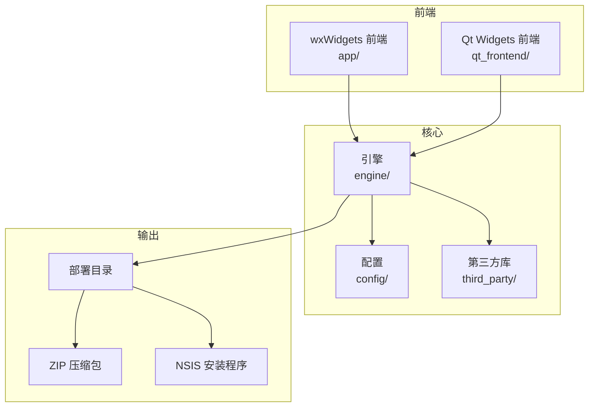
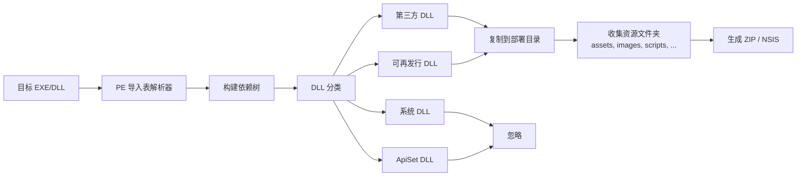
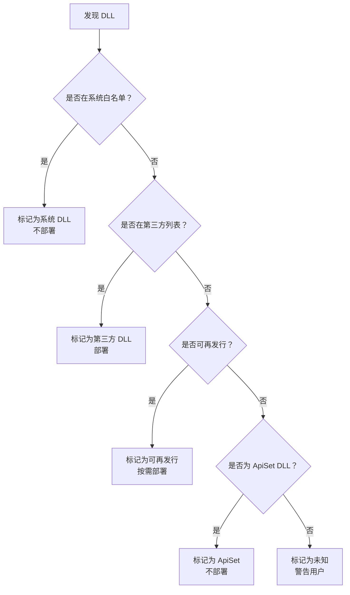
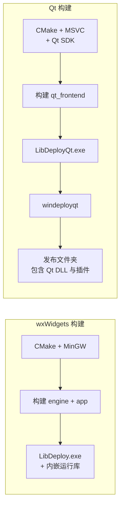

<p align="center">
  
</p>

<h1 align="center">LibDeploy</h1>

<p align="center">
  <strong>Windows 桌面应用的依赖分析与打包工具</strong>
</p>

<p align="center">
  <a href="#核心功能">核心功能</a> •
  <a href="#前端界面">前端界面</a> •
  <a href="#构建指南">构建指南</a> •
  <a href="#仓库结构">仓库结构</a> •
  <a href="#依赖说明">依赖说明</a> •
  <a href="#使用的开源项目">使用的开源项目</a> •
  <a href="#流程图">流程图</a>
</p>

<p align="center">
  <strong>简体中文</strong> · <a href="README.md">English</a>
</p>

<p align="center">
  
  
  
  
  
  
  
  
</p>

> **LibDeploy** 扫描 EXE/DLL，分类其运行时依赖，收集相关的资源文件夹，并生成可部署目录、ZIP 压缩包或 NSIS 安装程序。

---

## 界面预览

|            wxWidgets 前端             |                 Qt 前端                 |
| :-----------------------------------: | :-------------------------------------: |
|  |  |

---

## 核心功能

| 功能模块       | 说明                                                         |
| -------------- | ------------------------------------------------------------ |
| **依赖分析**   | 解析 PE 导入表，构建完整依赖树。                             |
| **DLL 分类**   | 区分系统 DLL、第三方 DLL、可再发行 DLL 和 ApiSet DLL。       |
| **资源打包**   | 保留 `assets/`、`images/`、`scripts/`、`docs/`、`plugins/`、`packages/`、`webview2_runtime/` 等文件夹。 |
| **部署**       | 将所需文件复制到干净的部署目录。                             |
| **打包**       | 生成 ZIP 压缩包和 NSIS 安装程序。                            |
| **安装体验**   | 添加开始菜单和桌面快捷方式。                                 |
| **兼容性检查** | 提示 WebView2 Runtime 版本与 Windows 7 / 8.1 的兼容性问题。  |
| **界面特性**   | 支持中/英文语言切换，以及亮色/暗色/跟随系统主题。            |

---

## 前端界面

LibDeploy 提供了两套桌面前端，共享同一个核心引擎。

| 前端           | 路径           | 构建依赖                     | 备注                                    |
| -------------- | -------------- | ---------------------------- | --------------------------------------- |
| **wxWidgets**  | `app/`         | CMake + MinGW-w64            | wxWidgets 和运行库已打包在仓库中。      |
| **Qt Widgets** | `qt_frontend/` | CMake + Qt SDK + MSVC 工具链 | 使用 `windeployqt` 自动复制 Qt 运行库。 |

**共享核心模块：**

```text
engine/     PE 解析、DLL 分类、依赖解析、部署逻辑
config/     JSON 配置管理
```

---

## 构建指南

详细构建说明请参考 [docs/BUILD.md](docs/BUILD.md)。

### 🔧 wxWidgets 构建

**所需工具：**

- CMake 3.20+
- MinGW-w64 GCC 13+

所有 wxWidgets 构建依赖均已**内嵌**：

```text
third_party/wxwidgets/
third_party/zlib/
third_party/minizip/
third_party/nlohmann/
runtime/
tools/
```

> ✅ 无需 vcpkg、无需网络、无需安装额外第三方库。

```bat
cmake -B build -G "MinGW Makefiles" -DCMAKE_BUILD_TYPE=Release
cmake --build build -j4
```

**输出：** `build/bin/LibDeploy.exe`

---

### ⚙️ Qt 构建

Qt 前端复用相同的内嵌核心依赖，但构建 Qt UI 需要**本地 Qt SDK**。

**需要的 Qt 组件：**

- Qt Widgets
- Qt Concurrent
- Qt LinguistTools
- `windeployqt`

**已验证的本地套件：** `Qt 5.12.12 msvc2017_64`

```bat
cmake -S .\qt_frontend -B .\build_qt ^
  -DCMAKE_PREFIX_PATH=C:\Qt\Qt5.12.12\5.12.12\msvc2017_64
cmake --build .\build_qt --config Release -j4
```

**输出：** `build_qt/bin/Release/LibDeployQt.exe`

> 💡 构建完成后，Qt 的 DLL、插件、MSVC 运行库、NSIS 工具、配置文件和翻译文件会自动复制到发布文件夹。**最终用户无需单独安装 Qt。**

---

## 仓库结构

```text
LibDeploy/
├── app/                  # wxWidgets 前端
├── qt_frontend/          # Qt Widgets 前端
├── engine/               # 核心依赖分析与部署逻辑
├── config/               # JSON 配置管理
├── cmake/                # CMake 辅助脚本
├── docs/                 # 项目文档
├── locale/               # wxWidgets .po 翻译源文件
├── assets/               # 应用图标和原始素材
├── third_party/          # 内嵌的第三方源码/预编译库
├── runtime/              # wxWidgets 发布所需的 MinGW 运行库
├── tools/                # 内嵌的部署工具
├── CMakeLists.txt
├── libdeploy_config.json
└── .gitignore
```

---

## 依赖说明

### wxWidgets 前端的内嵌依赖

| 依赖            | 位置                     | 用途                                    |
| --------------- | ------------------------ | --------------------------------------- |
| wxWidgets 3.3.1 | `third_party/wxwidgets/` | wxWidgets UI，预编译 x64 MinGW 动态库包 |
| zlib            | `third_party/zlib/`      | 压缩支持                                |
| minizip         | `third_party/minizip/`   | ZIP 打包                                |
| nlohmann/json   | `third_party/nlohmann/`  | JSON 配置解析                           |
| MinGW runtime   | `runtime/`               | 复制到 `LibDeploy.exe` 旁边的运行库 DLL |
| NSIS            | `tools/nsis/`            | 安装程序生成                            |

### Qt 前端使用的依赖

| 依赖             | 来源                        | 用途                 |
| ---------------- | --------------------------- | -------------------- |
| zlib             | `third_party/zlib/`         | 共享压缩依赖         |
| minizip          | `third_party/minizip/`      | 共享 ZIP 打包依赖    |
| nlohmann/json    | `third_party/nlohmann/`     | 共享 JSON 配置解析   |
| NSIS             | `tools/nsis/`               | 安装程序生成         |
| Qt Widgets       | 本地 Qt SDK                 | Qt UI                |
| Qt Concurrent    | 本地 Qt SDK                 | 后台分析/部署任务    |
| Qt LinguistTools | 本地 Qt SDK                 | 翻译编译             |
| MSVC runtime     | Visual Studio / Build Tools | 复制到 Qt 发布文件夹 |

---

## 使用的开源项目

| 项目                    | 用途             | 许可证                                     |
| ----------------------- | ---------------- | ------------------------------------------ |
| wxWidgets               | wxWidgets 前端   | wxWindows Library Licence                  |
| Qt                      | Qt 前端          | LGPL/GPL/商业（取决于 Qt SDK）             |
| zlib                    | 压缩             | zlib License                               |
| minizip                 | ZIP 打包         | zlib License                               |
| nlohmann/json           | JSON 配置        | MIT License                                |
| NSIS                    | 安装程序生成     | zlib/libpng-style license                  |
| GCC / MinGW-w64 runtime | wxWidgets 运行库 | GPL runtime exception / MinGW-w64 licenses |
| CMake                   | 构建系统         | BSD 3-Clause License                       |

**额外内嵌工具：**

| 工具             | 位置                | 备注                                    |
| ---------------- | ------------------- | --------------------------------------- |
| Everything tools | `tools/everything/` | 辅助工具。Everything **不是**开源项目。 |

---

## 流程图

### 系统架构

两个前端（wxWidgets 和 Qt Widgets）共享相同的核心引擎、配置和第三方库。



### 依赖分析流程



### DLL 分类决策树



### 构建流程对比（wxWidgets vs Qt）



## 📊 项目统计

#### 提交看板

<p align="center">
  
</p>
